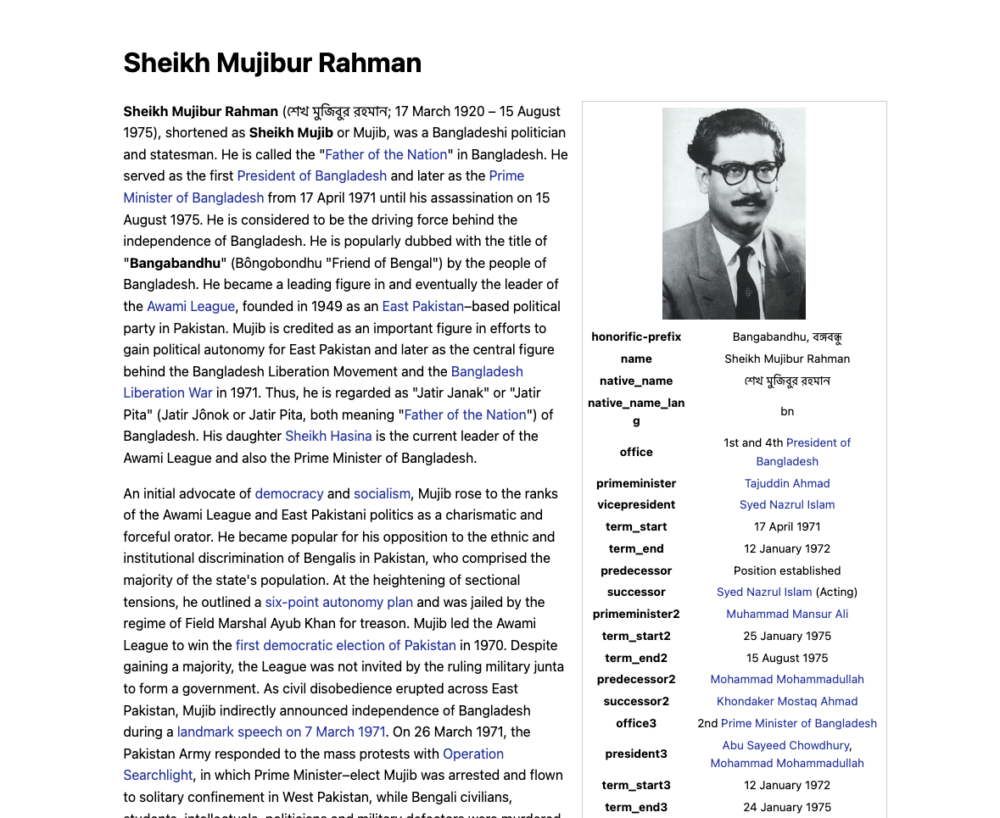

# mujib.org

This project is made using Vue2. The template has been taken from [static.wiki](https://static.wiki) . 
Static wiki generates static web page from wikipedia database. Find the git repository of static.wiki [here](https://github.com/segfall/static-wiki).

The source of the logo can be found [here](https://www.behance.net/gallery/90203543/Project-MUJIB-BORSHO-Bangabandhu-Sheikh-Mujibur-Rahman). 

Feel free to contribute if you want. Ping me at *shuhan dot mirza at gmail dot com*

### Site screenshot

### Licence
This site is under the MIT License. Furthermore, the content has been adapted under the [Creative Commons Attribution-ShareAlike 3.0 Unported License (CC-BY-SA)](https://en.wikipedia.org/wiki/Wikipedia:Text_of_Creative_Commons_Attribution-ShareAlike_3.0_Unported_License).